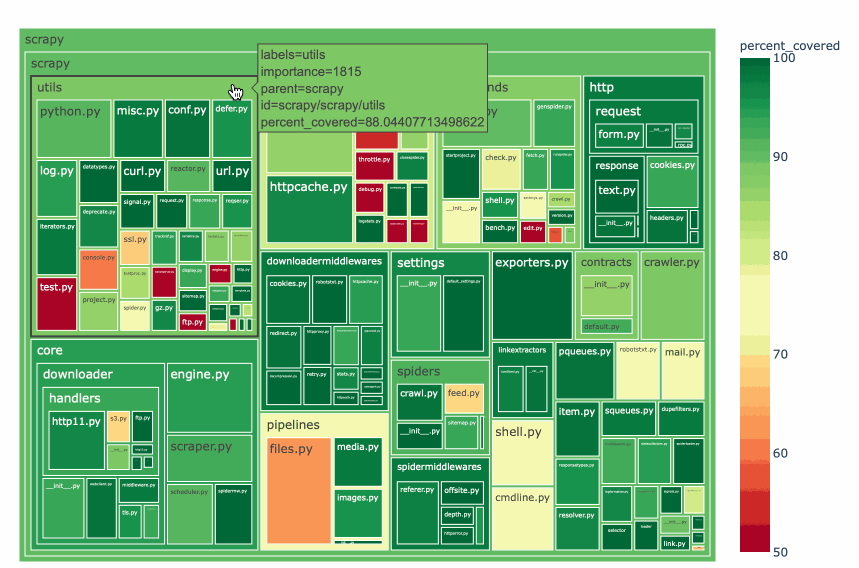
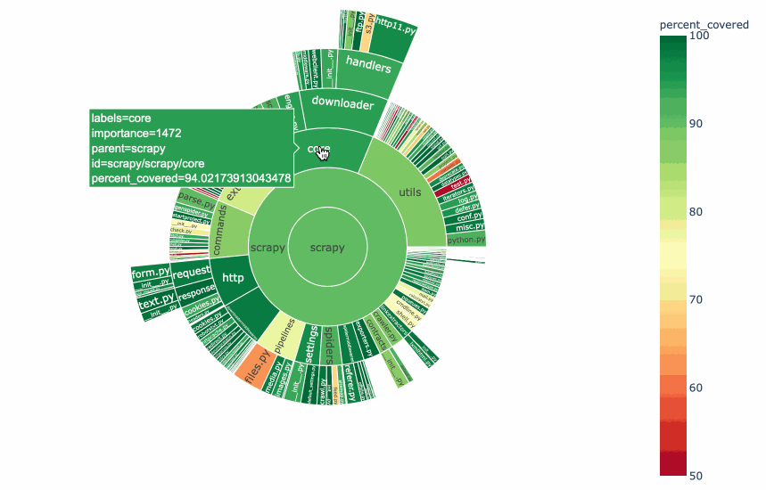

Coverage Plot
=============

Coverage-plot is a console script to visualize the test coverage for Python projects.
It generates Treemap and Sunburst visualizations from your coverage reports.

Here is an example of the Treemap report.

Here is the same report, but in the Sunburst format.

Follow the tutorial to read more.

.. toctree::
    :maxdepth: 2
    :caption: Contents:

    tutorial
