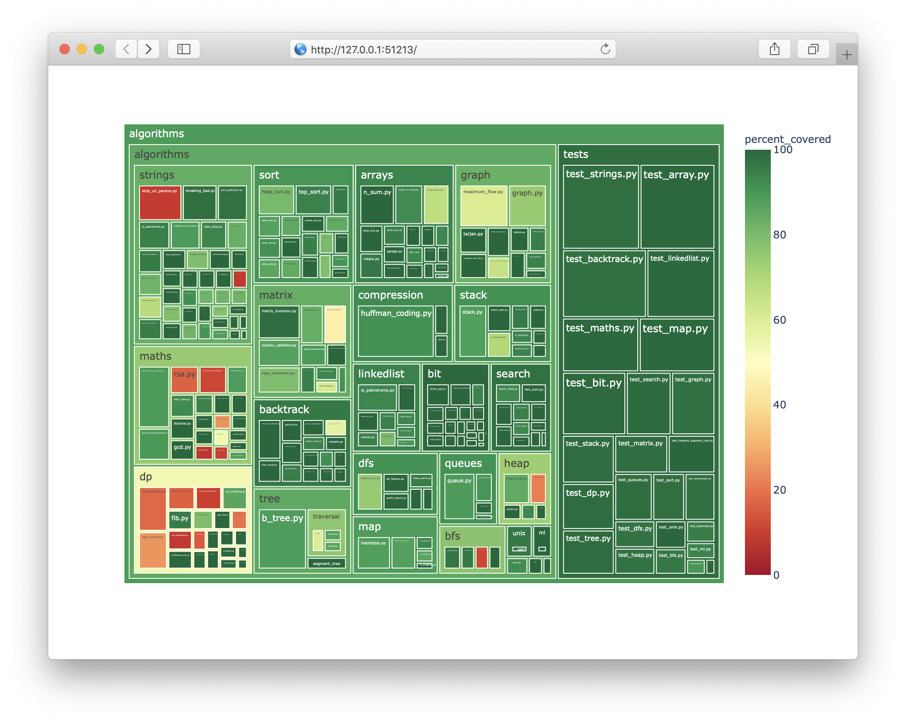
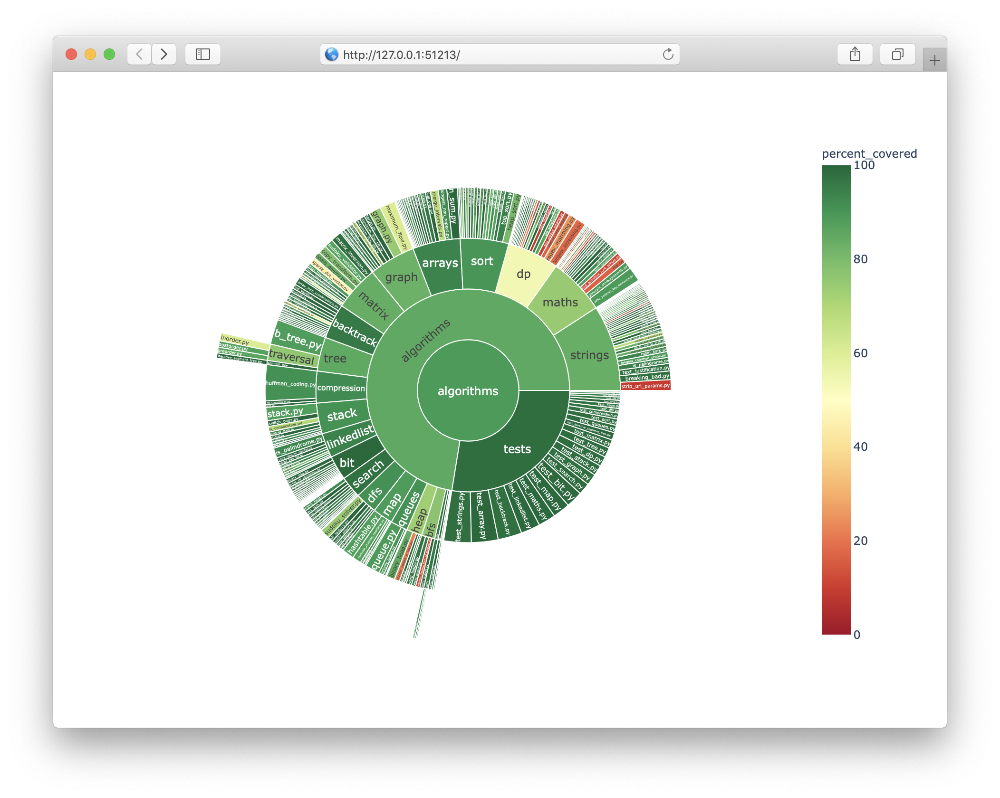

Tutorial
========

In this tutorial, we run tests and visualize the coverage results for `algorithms <https://github.com/keon/algorithms>`_, a project with pythonic implementations of data structures and algorithms. This project has fast and self-contained tests that are easy to run and interpret.

Get the project
---------------

Clone the project, initialize virtual environment, and install the dependencies::

    git clone git@github.com:keon/algorithms.git
    cd algorithms
    python -m venv env
    source env/bin/activate
    pip install -e .
    pip install pytest coverage

Run the tests
-------------

Run tests with pytest and coverage::

    coverage run -m pytest ./tests

As a result, you should have all your tests passed, and a new file :file:`.coverage` appears in the current directory. Export the coverage statistics to the XML format::

    coverage xml

This command creates a new file :file:`coverage.xml`

Visualize your coverage results
-------------------------------

Install coverage-plot::

    pip install coverage-plot

Visualize your results::

    coverage-plot coverage.xml

The script opens your browser with a report that would look like this. The format is called Treemap.

You can choose the Sunburst visualization to get a different representation of the same result::

    coverage-plot --plot-type=sunburst coverage.xml

Share your coverage results
---------------------------

To share the results of your work, you can export them in a self-contained HTML file. This file can be shared as an attachment, uploaded to S3, or stored as a CI artifact.

::

    coverage-plot --no-show --save=treemap.html coverage.xml
